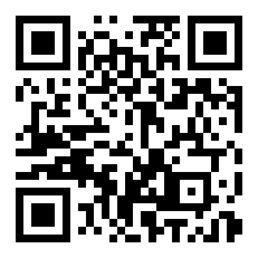
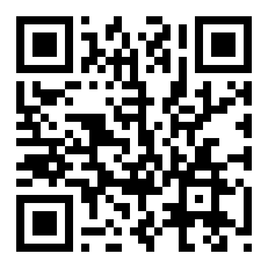
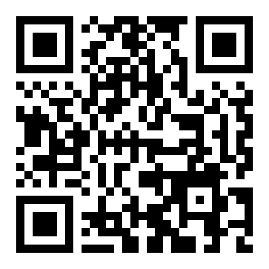
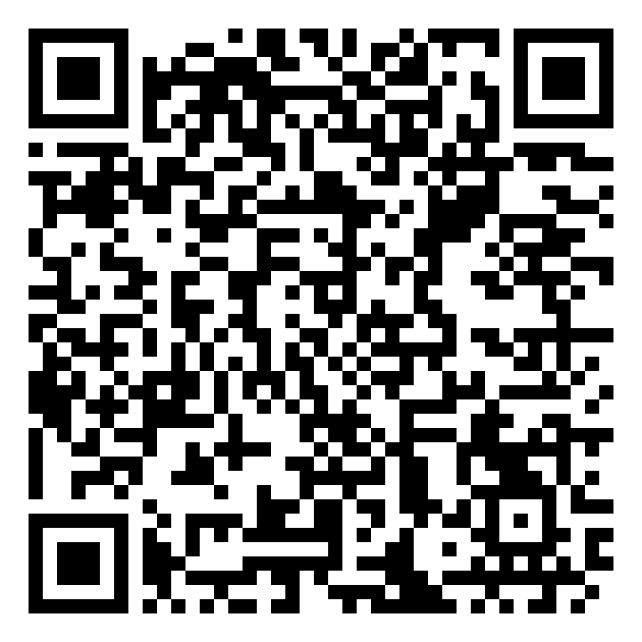
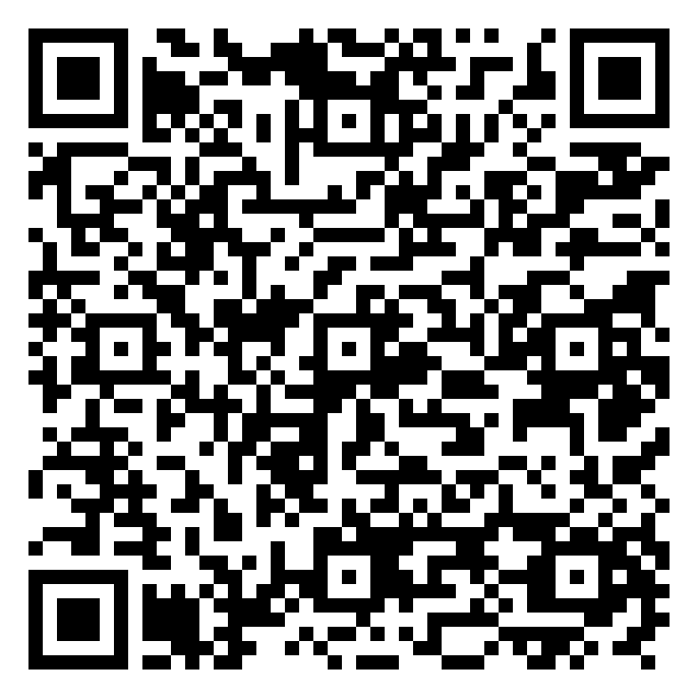
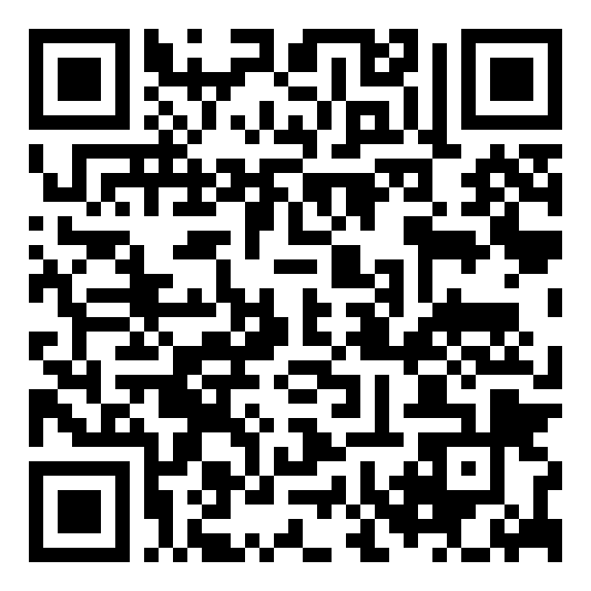
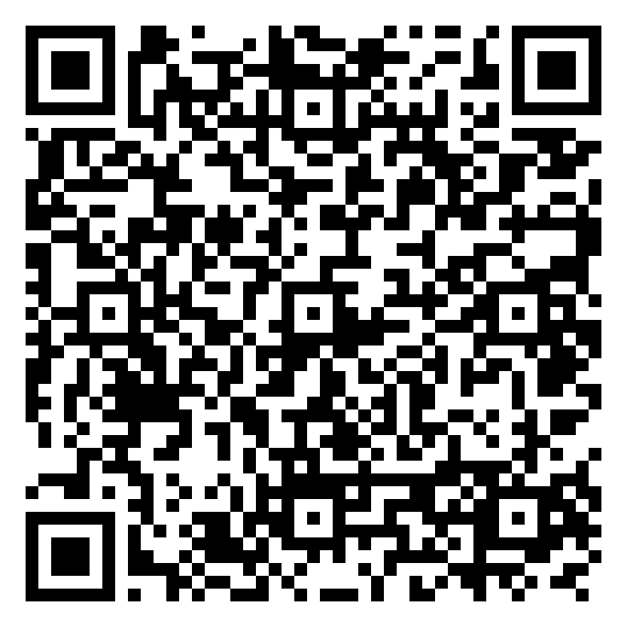
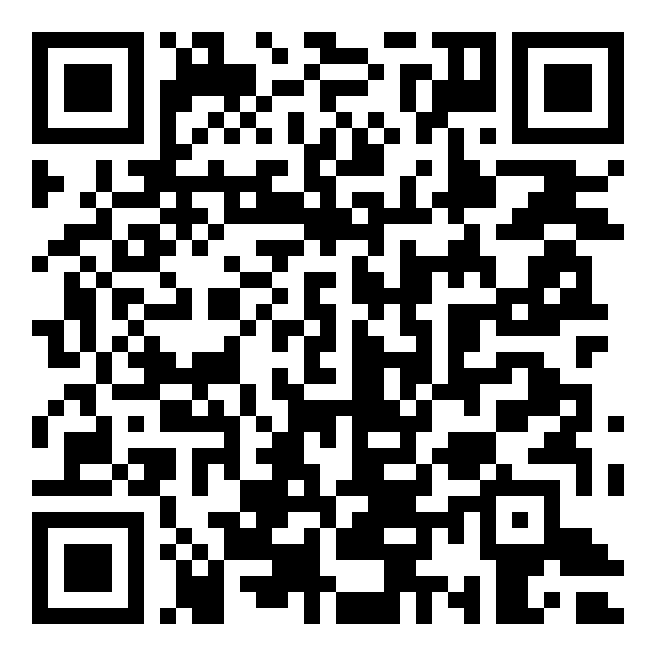

# QR codes

For the TOKEN2049 slides, posters and the site. Each code was decoded after generation to check it opens the URL listed. SVG for slides and print, PNG (16 px per module) for anything that wants a bitmap. The same SVGs are served on the site under `/static/img/qr/` and shown on [exo.myargoquest.com/token2049](https://exo.myargoquest.com/token2049/).

| Code | What | Opens | Files |
|---|---|---|---|
|  | **Website** | <https://exo.myargoquest.com> | [`website.svg`](website.svg) · [`website.png`](website.png) |
|  | **TOKEN2049 page** | <https://exo.myargoquest.com/token2049/> | [`token2049.svg`](token2049.svg) · [`token2049.png`](token2049.png) |
|  | **GitHub repo** | <https://github.com/kon-rad/argo-exo> | [`github.svg`](github.svg) · [`github.png`](github.png) |
|  | **Demo video** | <https://www.youtube.com/watch?v=xZ9dDkm9N3Y> | [`video.svg`](video.svg) · [`video.png`](video.png) |
|  | **Slide deck** | <https://docs.google.com/presentation/d/1jMS6c9_Qkjl9TIvXBBCmAikPJLPxmV9X_ygEas1I3mg/edit?usp=sharing> | [`slides.svg`](slides.svg) · [`slides.png`](slides.png) |
|  | **Chainlink CRE evidence** | <https://github.com/kon-rad/argo-exo/blob/main/docs/hackathon-evidence.md#chainlink-cre-the-transaction-guardian-workflow> | [`cre-evidence.svg`](cre-evidence.svg) · [`cre-evidence.png`](cre-evidence.png) |
|  | **CRE simulator runs (raw output)** | <https://github.com/kon-rad/argo-exo/tree/main/docs/evidence/cre> | [`cre-runs.svg`](cre-runs.svg) · [`cre-runs.png`](cre-runs.png) |
|  | **NOWNodes evidence** | <https://github.com/kon-rad/argo-exo/blob/main/docs/hackathon-evidence.md#nownodes-which-endpoint-powers-what> | [`nownodes-evidence.svg`](nownodes-evidence.svg) · [`nownodes-evidence.png`](nownodes-evidence.png) |
|  | **NOWNodes live check (raw output)** | <https://github.com/kon-rad/argo-exo/blob/main/docs/evidence/nownodes/live-check.txt> | [`nownodes-live-check.svg`](nownodes-live-check.svg) · [`nownodes-live-check.png`](nownodes-live-check.png) |

Regenerate: `pip install segno && python scripts/make_qr.py docs/qr site/static/img/qr`. If a URL changes, change it in `scripts/make_qr.py` and in `site/content/token2049.json`.
